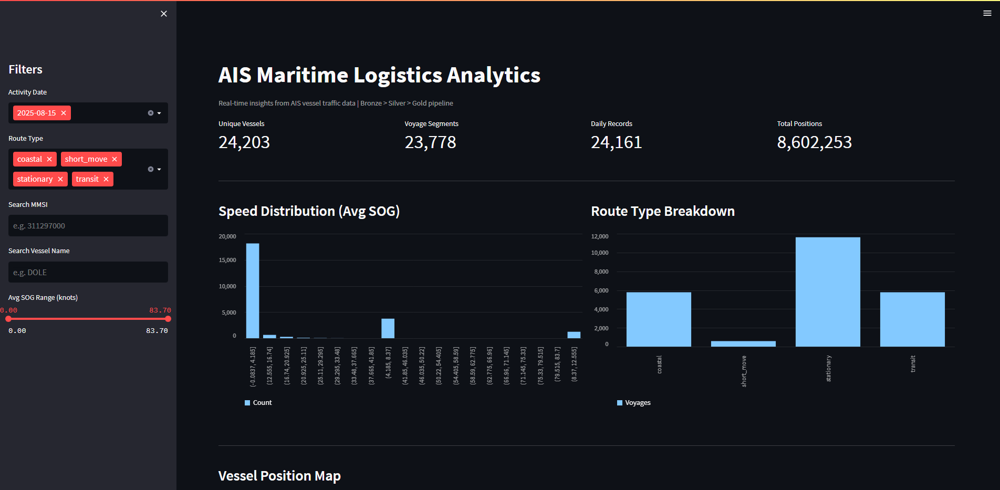
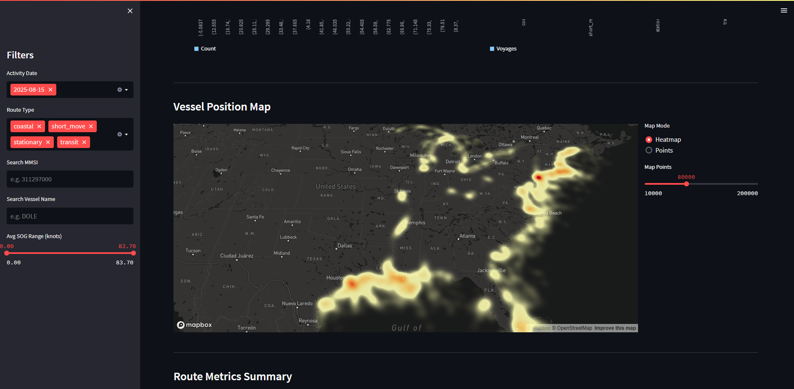
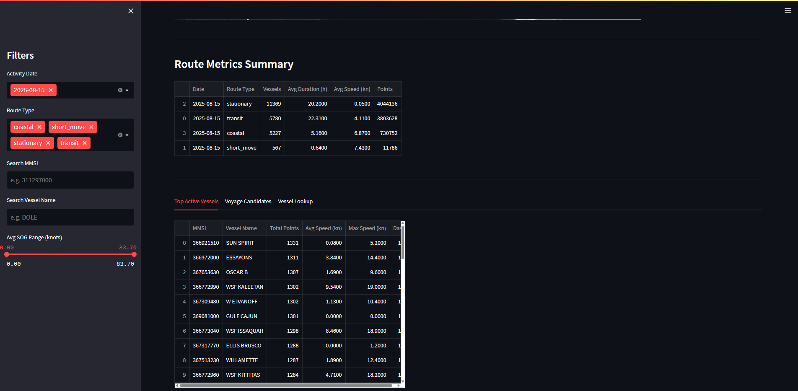
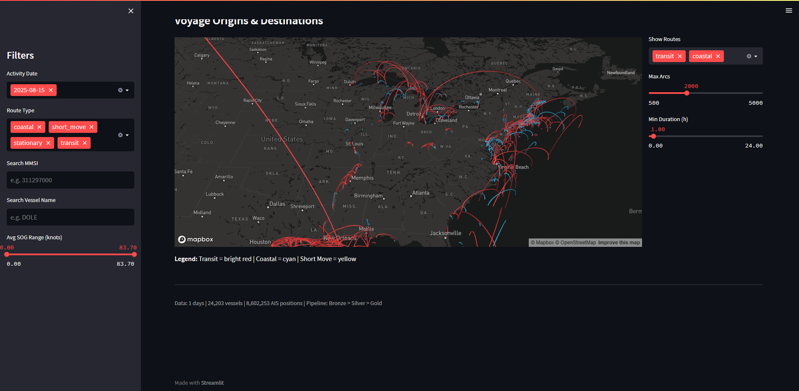

# AIS-Based Maritime Logistics Analytics Pipeline

End-to-end data pipeline that transforms **raw AIS vessel traffic data** (~250MB/day compressed) into analytics-ready datasets through a medallion architecture (Bronze/Silver/Gold), with a Streamlit dashboard for visualization.

## Dashboard Demo

### KPI Cards + Speed Distribution + Route Breakdown


### Vessel Position Heatmap (80K points, US waters)


### Route Metrics + Top Active Vessels Table


### Voyage Origin-Destination Arc Map (transit=red, coastal=cyan)


## Architecture

```
+-------------------------------+
|   MarineCadastre AIS Source   |
|   (.csv.zst, ~250MB/day)      |
+---------------+---------------+
                |
                | Stream decompress (zstandard)
                | Schema enforcement
                |
+---------------v---------------+
|         BRONZE LAYER          |
|   Raw normalized parquet      |
|   Partition: year/month/day   |
+---------------+---------------+
                |
                | Timestamp normalization
                | Type casting + validation
                | Deduplication (mmsi + event_time)
                |
+---------------v---------------+
|         SILVER LAYER          |
|   Cleaned vessel positions    |
|   Partition: source_date      |
+------+--------+--------+-----+
       |        |        |
       v        v        v
  +--------+ +------+ +--------+
  |Metadata| |Daily | |Voyage  |
  |Builder | |Agg.  | |Builder |
  +---+----+ +--+---+ +---+----+
      |         |          |
      v         v          v
+---------------v---------------+
|          GOLD LAYER           |
| vessel_metadata               |
| vessel_daily_activity         |
| voyage_candidates             |
| route_metrics                 |
+------+---------------+-------+
       |               |
       v               v
+-------------+ +--------------+
|  PostgreSQL | | AWS Athena   |
|  (serving)  | | (S3 query)   |
+------+------+ +------+-------+
       |               |
       v               v
+-------------------------------+
|   Streamlit Dashboard         |
|   Heatmap + Arc Map + Tables  |
+-------------------------------+
```

## Tech Stack

| Component | Technology | Purpose |
|-----------|-----------|---------|
| Processing | **PySpark 3.5** | Batch ETL on multi-GB datasets |
| Compression | **zstandard** | Stream decompress .csv.zst without full extraction |
| Storage | **Parquet** | Columnar format, snappy compression, partitioned |
| Orchestration | **Apache Airflow** | DAG with 9 tasks, daily schedule |
| Serving | **PostgreSQL** | JDBC load from gold layer |
| Analytics | **AWS Athena** | External tables on S3 parquet |
| Dashboard | **Streamlit + pydeck** | Heatmap, arc map, vessel lookup |
| Quality | **Custom checks** | Row count, null rate, range, duplicates |
| Metrics | **JSON tracker** | Stage timing, row counts per run |
| Container | **Docker Compose** | Postgres + Spark + Airflow stack |

## Data Source

**MarineCadastre AIS** - daily vessel position files for US waters.

| Property | Value |
|----------|-------|
| Format | `.csv.zst` (Zstandard-compressed CSV) |
| Size | ~250MB compressed, ~1.5GB uncompressed per day |
| Rows | ~8.7M position reports per day |
| Columns | mmsi, base_date_time, longitude, latitude, sog, cog, heading, vessel_name, imo, call_sign, vessel_type, status, length, width, draft, cargo, transceiver |

## Pipeline Stages

### Stage 1 : Raw to Bronze
Discover `.csv.zst` files, stream-decompress, enforce schema, write partitioned parquet (year/month/day). State tracker prevents re-ingesting processed files.

### Stage 2 : Bronze to Silver
Normalize timestamps, cast types, validate coordinates/speed/MMSI, deduplicate by (mmsi, event_time). Quality checks run after each stage.

### Stage 3 : Silver to Gold
| Output | Logic |
|--------|-------|
| `vessel_metadata` | Deduplicate vessel info per MMSI, keep most complete row |
| `vessel_daily_activity` | Group by (mmsi, date): point_count, avg/max/min SOG, first/last seen |
| `voyage_candidates` | Time-gap segmentation (>4h gap = new voyage), classify as stationary/short_move/coastal/transit |
| `route_metrics` | Aggregate voyage stats by route type and date |

### Stage 4 : Serving + Dashboard
Load gold tables into PostgreSQL via JDBC. Streamlit dashboard reads parquet directly with pyarrow.

## Data Model

```
+------------------+       +------------------------+
| vessel_metadata  |       | vessel_daily_activity   |
+------------------+       +------------------------+
| mmsi (PK)        |<------| mmsi                    |
| vessel_name      |       | activity_date           |
| imo              |       | point_count             |
| call_sign        |       | avg_sog / max / min     |
| vessel_type      |       | first_seen / last_seen  |
| length / width   |       +------------------------+
| transceiver      |
+------------------+       +------------------------+
        |                  | voyage_candidates       |
        |                  +------------------------+
        +----------------->| mmsi                    |
                           | start_time / end_time   |
                           | start_lat / start_lon   |
                           | end_lat / end_lon       |
                           | duration_hours          |
                           | avg_sog                 |
                           | candidate_route_type    |
                           +----------+-------------+
                                      |
                           +----------v-------------+
                           | route_metrics           |
                           +------------------------+
                           | route_id (PK)           |
                           | metric_date             |
                           | candidate_route_type    |
                           | vessel_count            |
                           | avg_duration_hours      |
                           | avg_speed / point_count |
                           +------------------------+
```

## Orchestration (Airflow DAG)

```
discover_raw_files
        |
        v
ingest_to_bronze
        |
        v
bronze_to_silver
        |
   +----+----+------------------+
   |         |                  |
   v         v                  v
build_    build_daily_    build_voyage_
metadata  activity        candidates
   |         |                  |
   |         |                  v
   |         |           build_route_metrics
   |         |                  |
   +----+----+------------------+
        |
        v
  load_postgres
        |
        v
 run_quality_checks
```

## Quick Start

```bash
# Prerequisites: Python 3.9+, Java 11+

# Install
pip install pyspark==3.5.3 zstandard pyarrow python-dotenv streamlit pydeck==0.7.1

# Place .csv.zst files in data/raw/ais/

# Run pipeline (1 file test)
python main.py --sample

# Run all files
python main.py --all

# Launch dashboard
streamlit run app.py

# Run tests
pytest tests/ -v
```

### Spark Jobs (individual)

```bash
spark-submit spark_jobs/ingest_raw_to_bronze.py --file-limit 1
spark-submit spark_jobs/bronze_to_silver.py --source-date 2025-08-15
spark-submit spark_jobs/silver_to_gold_activity.py --source-date 2025-08-15
spark-submit spark_jobs/silver_to_gold_voyage.py --source-date 2025-08-15
spark-submit spark_jobs/silver_to_gold_routes.py
```

### Docker (PostgreSQL + Airflow)

```bash
docker-compose up -d
# Airflow UI: http://localhost:8081 (admin/admin)
# PostgreSQL: localhost:5432 (postgres/postgres)
```

## Project Structure

```
project/
+-- config/                     # Settings, paths, logging, .env loader
+-- ingestion/                  # read_zst, schema_detect, batch_ingest, state_tracker
+-- processing/                 # bronze_reader, silver_cleaner, metadata/activity/voyage/route builders
+-- spark_jobs/                 # Standalone spark-submit scripts per stage
+-- storage/                    # parquet_writer, s3_client, postgres_loader
+-- quality/                    # data_quality_checks, expectations per layer
+-- metrics/                    # pipeline_metrics (timing, row counts, JSON persist)
+-- orchestration/              # Airflow DAG (9 tasks, daily schedule)
+-- sql/                        # DDL for Athena external tables + PostgreSQL serving
+-- utils/                      # file, time, geo (haversine), validation, dataframe helpers
+-- tests/                      # test_read_zst, test_schema, test_validation, test_geo
+-- data/
|   +-- raw/ais/                # Source .csv.zst files
|   +-- bronze/                 # Partitioned raw parquet (year/month/day)
|   +-- silver/                 # Cleaned positions (source_date)
|   +-- gold/                   # Analytics tables (activity, voyage, route, metadata)
+-- app.py                      # Streamlit dashboard
+-- main.py                     # Full pipeline entry point
+-- docker-compose.yml          # Postgres + Spark + Airflow
+-- .env / .env.example         # Environment configuration
```

## Sample Queries

```sql
-- Most active vessels on a given day
SELECT m.vessel_name, a.point_count, a.avg_sog
FROM vessel_daily_activity a
JOIN vessel_metadata m ON a.mmsi = m.mmsi
WHERE a.activity_date = '2025-08-15'
ORDER BY a.point_count DESC LIMIT 10;

-- Long-distance transit voyages
SELECT mmsi, duration_hours, avg_sog, start_time, end_time
FROM voyage_candidates
WHERE candidate_route_type = 'transit' AND duration_hours > 24
ORDER BY duration_hours DESC;

-- Route type distribution per day
SELECT metric_date, candidate_route_type, vessel_count, avg_speed
FROM route_metrics
ORDER BY metric_date, vessel_count DESC;
```


